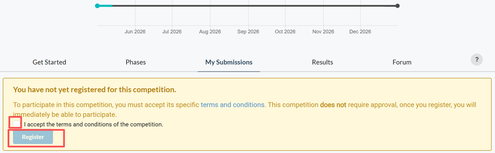

# Submission Instructions

## Submission Format

### Track 1 Submission Format

Participants must submit a `submission.zip` file containing:

```text
submission.zip
|-- submission.json
`-- images/
    |-- track1_0001.jpg
    |-- track1_0002.jpg
    `-- ...
```

The `submission.json` file must follow the format below:

```json
[
  {
    "sample_id": "track1_0001",
    "path": "images/track1_0001.jpg"
  },
  {
    "sample_id": "track1_0002",
    "path": "images/track1_0002.jpg"
  }
]
```

Each generated image filename must exactly match its corresponding `sample_id`.

### Track 2 Submission Format

#### Submission Structure

Participants must submit a `submission.zip` file containing:

```text
submission.zip
`-- submission.json
```

Each item in `submission.json` must follow the format below:

```json
{
  "sample_id": "track2_0001",
  "emotion": "calm",
  "emotional_valence": "Positive",
  "emotional_arousal_level": "Low",
  "overall_caption": "A peaceful landscape with soft colors and balanced composition creates a calm and reflective emotional atmosphere.",
  "brushstroke": "Soft and smooth brushstrokes contribute to emotional gentleness.",
  "composition": "The centered and balanced composition enhances visual stability.",
  "color": "Muted blue and green tones evoke tranquility and comfort.",
  "line": "Gentle flowing lines create a relaxed visual rhythm.",
  "light": "Soft lighting and low contrast reinforce the peaceful mood."
}
```

Participants are encouraged to provide concise, interpretable, and semantically meaningful descriptions grounded in the visual and emotional content of the artwork, rather than relying on fixed templates or keyword-only outputs.

## Submission Process

### Step 1. Create a Codabench Account

Please make sure that you have already created a Codabench account before participating in the challenge.

- Codabench: <https://www.codabench.org/>
- Codabench challenge link:
  - Track 1: <https://www.codabench.org/competitions/16299/>
  - Track 2: <https://www.codabench.org/competitions/16304/>

After entering the Codabench challenge page, click **Register** to join the competition.



### Step 2. Create an Organization

Before submitting, please create an organization.


When creating an organization, please complete the team information.

The following fields are required:

```text
Organization Name: please enter the same team name used during registration.
Organization Email: please enter the same contact email address used during registration.
```

Please ensure that the Organization Name matches the **team name** provided during registration, and that the Organization Email matches the **contact email address** provided during registration.


After filling in the required information, click **Submit** to save the team.


### Step 3. Submit as an Organization

After your team is created successfully, go to the submission page.

Please make sure you are submitting **under your organization name**, not only as an individual user.


### Step 4. Upload the Submission File

Click the submission upload button and select your **submission.zip** file.


Please wait while uploading.


### Step 5. Wait for Scoring

After uploading, Codabench will start evaluating your submission.

The submission may go through several states, such as:


When the status becomes **Finished**, the evaluation is complete.

### Step 6. Check the Leaderboard

After scoring is finished, you can check your result on the leaderboard.

The leaderboard will show the official scores for the corresponding track.


## Important Notes

- The Organization Name must match the team name used during registration, and the Organization Email must match the contact email address used during registration. Submissions with inconsistent team information will not be considered for ranking.
- Each team must use only one Codabench account for submission.
- Each team can submit at most once per day and no more than 5 times in total during the competition period; failed submissions will not count toward either the daily submission limit or the total submission limit.
- The daily submission limit is reset according to UTC time.
- Codabench provides a limited resource quota for each user, approximately 15 GB. Please delete outdated or unused submissions in time to avoid exceeding the storage limit.
- After the submission deadline, we will conduct a Reproducibility Verification stage. For each track, the top three teams on the leaderboard will be required to provide their method code and a technical report for verification.
